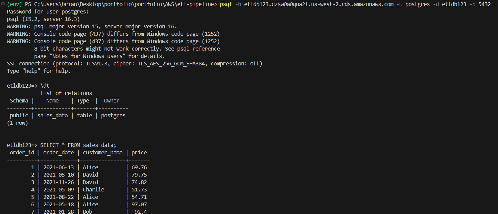
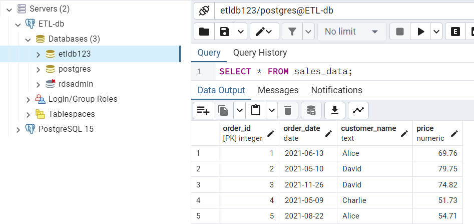
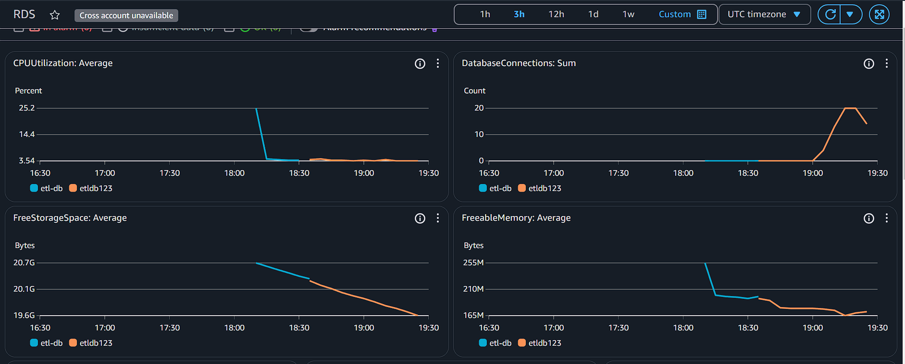

# ETL Pipeline with AWS RDS, S3 and Python

## Project Overview
This project demonstrates how to create an ETL pipeline that interacts with a PostgreSQL database hosted on AWS RDS. The pipeline connects to the database, creates a table, and stores sample data. This is a basic example meant to help you understand how to work with AWS services, PostgreSQL, and Python.

## Table of Contents
1. [Prerequisites](#prerequisites)
2. [Setup](#setup)
3. [Usage](#usage)
4. [How It Works](#how-it-works)
5. [License](#license)

---

## Prerequisites
Before starting with this project, ensure you have the following installed and set up:

- **Python 3.6+**: Ensure Python is installed on your system. You can download it from [Python's official website](https://www.python.org/downloads/).
- **PostgreSQL**: You need to have access to a PostgreSQL database. In this case, we will be using **AWS RDS**.
- **AWS RDS Instance**: A PostgreSQL RDS instance created on AWS.
- **Python Libraries**: `psycopg2` is used to interact with PostgreSQL from Python. Install it using pip:
  ```bash
  pip install psycopg2
  ```

---

## Setup
### Step 1: Set Up AWS RDS PostgreSQL
1. **Create an RDS PostgreSQL Instance**:
   - Go to the **AWS Management Console**.
   - Navigate to **RDS** and create a new PostgreSQL database instance.
   - Choose a unique database name, username, and password.
   - Ensure the instance is publicly accessible.
   - Note down the **endpoint** (e.g., `etldb123.czsw0a0qua2l.us-west-2.rds.amazonaws.com`).

2. **Configure Security Group**:
   - Ensure the security group allows inbound traffic on port 5432 (PostgreSQL default port).
   - Allow your IP address to access the RDS instance.

3. **Database Connection Details**:
   - **Host**: The RDS endpoint (e.g., `etldb123.czsw0a0qua2l.us-west-2.rds.amazonaws.com`).
   - **Port**: 5432 (default for PostgreSQL).
   - **Database Name**: `etldb123` (or the name you choose).
   - **Username**: `postgres` (or the username you specified).
   - **Password**: The password you set when creating the RDS instance.

---

## Usage
1. **Clone the Repository**:
   Clone the repository to your local machine using Git:
   ```bash
   git clone https://github.com/spencerbbrian/portfolio/tree/main/AWS/etl-pipeline
   ```

2. **Create the PostgreSQL Table**:
   - Open a terminal and navigate to the project folder:
     ```bash
     cd etl-pipeline
     ```
   - Ensure you have configured the database connection details correctly in the Python script `create_table.py`.

3. **Run the Script**:
   Run the `create_table.py` script to create the `sales_data` table and insert sample data:
   ```bash
   python create_table.py
   ```

   If successful, the script will print:
   ```
   Database 'etldb123' created successfully!
   Table created successfully!
   ```

---

## How It Works
1. **Connect to PostgreSQL**:
   The Python script connects to the PostgreSQL database hosted on AWS RDS using the `psycopg2` library.

2. **Create a Database**:
   The script checks if the database `etldb123` exists, and if it doesn't, it creates the database.

3. **Create a Table**:
   The script executes a SQL `CREATE TABLE` command to create the `sales_data` table with the following schema:
   ```sql
   CREATE TABLE IF NOT EXISTS sales_data (
       order_id SERIAL PRIMARY KEY,
       order_date DATE,
       customer_name TEXT,
       price numeric
   );
   ```

4. **Insert Data**:
   Sample data is inserted into the `sales_data` table. You can modify this part to pull data from a file or other source.

5. **View Data**:
   After running the script, you can connect to the PostgreSQL instance via **psql** or **pgAdmin** to view and query the `sales_data` table.

---

## How to View Data
You can use several methods to view the data inside your PostgreSQL table:

### Method 1: Using `psql` Command-Line Tool
1. Run the following command to connect to your database:
   ```bash
   psql -h etldb123.czsw0a0qua2l.us-west-2.rds.amazonaws.com -U postgres -d etldb123 -p 5432
   ```
2. List tables:
   ```sql
   \dt
   ```
3. View data:
   ```sql
   SELECT * FROM sales_data;
   ```

### Method 2: Using pgAdmin (Graphical Interface)
1. Open **pgAdmin** and connect to your RDS instance.
2. Navigate to your database `etldb123`.
3. Right-click on `sales_data` and choose "View Data" to see all the records.

### Screenshots






---


### Notes
- This project is designed as a learning tool for understanding how to interact with AWS RDS and use Python to automate database operations.
- The database and table creation part is simple, but you can extend this by adding more functionality like data extraction, transformation, and loading (ETL).
- You can also integrate AWS Lambda, AWS S3, and other AWS services to build a more complex ETL pipeline.