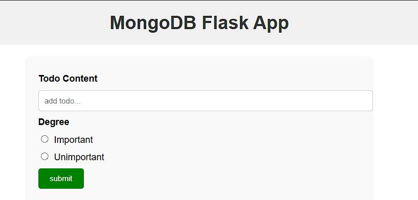
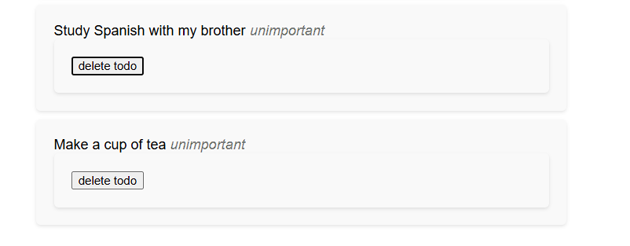

# MongoDB Flask App

This project is a simple Flask application that connects to a MongoDB database to manage a to-do list. Users can add, view, and delete tasks with degrees of importance.

## Features
- Add a new to-do item.
- View all to-do items with their importance degree.
- Delete a to-do item.

## Technologies Used
- Flask: For the web framework.
- MongoDB: As the database for storing to-do items.
- HTML/CSS: For the user interface.

## Prerequisites
Before running the application, ensure you have the following installed:
- Python 3.x
- MongoDB

## Installation
1. Clone the repository:
   ```bash
   git clone 
   ```
2. Navigate to the project directory:
   ```bash
   cd mongodb-flask-app
   ```
3. Create a virtual environment and activate it:
   ```bash
   python -m venv venv
   source venv/bin/activate  # On Windows: venv\Scripts\activate
   ```
4. Install the dependencies:
   ```bash
   pip install -r requirements.txt
   ```
5. Ensure MongoDB is running on `localhost:27017`.

## Usage
1. Start the Flask application:
   ```bash
   python app.py
   ```
2. Open your browser and navigate to:
   ```
   http://127.0.0.1:5000/
   ```
3. Use the form to add new to-do items and manage the list.

## File Structure
```
project/
│
├── static/
│   └── css/
│       └── styles.css   # CSS styles for the application
├── templates/
│   └── index.html       # HTML template for the application
├── app.py               # Main Flask application
├── requirements.txt     # Dependencies for the project
└── README.md            # Project documentation

```

## Requirements
Refer to the `requirements.txt` file for the Python dependencies.

## Screenshots
- Add Task Page: 
- View Tasks: 

## License
This project is open source and available under the MIT License.

## Acknowledgements
- Flask documentation: https://flask.palletsprojects.com/
- MongoDB documentation: https://www.mongodb.com/docs/
