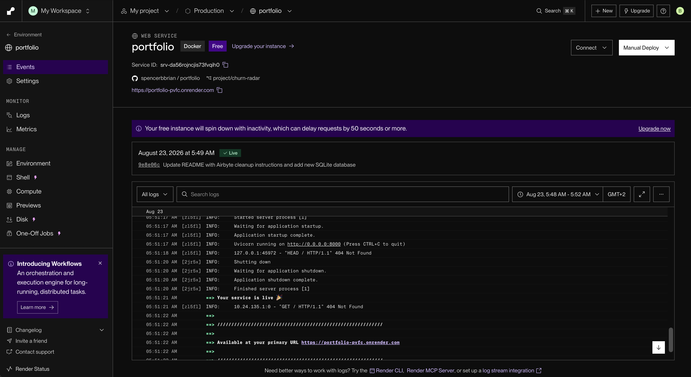
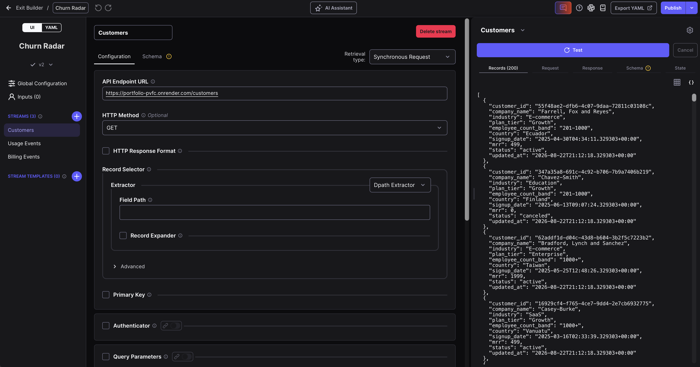
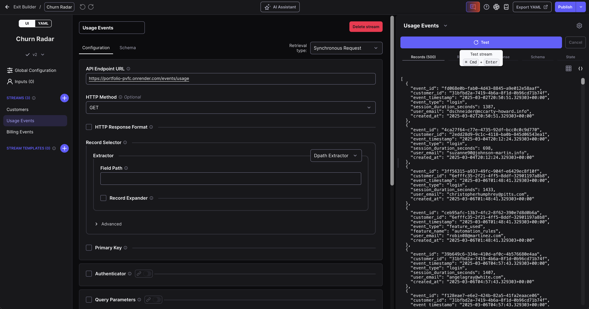
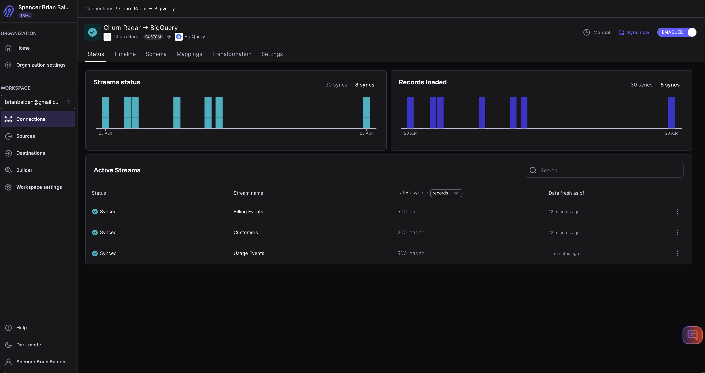
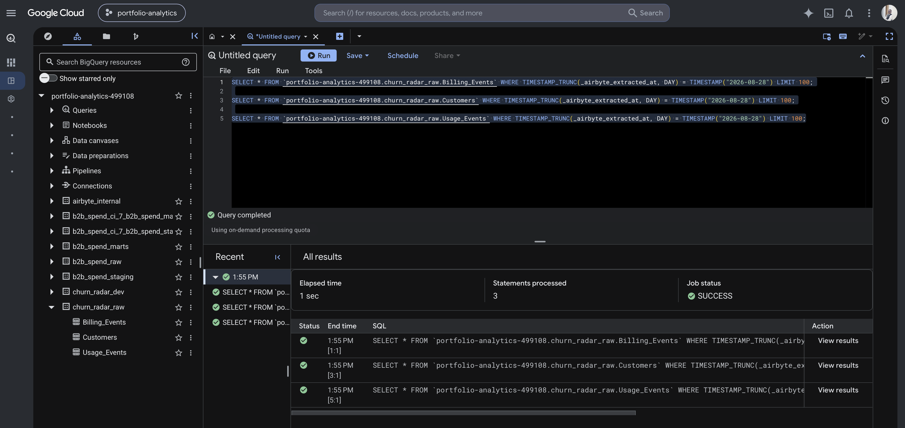
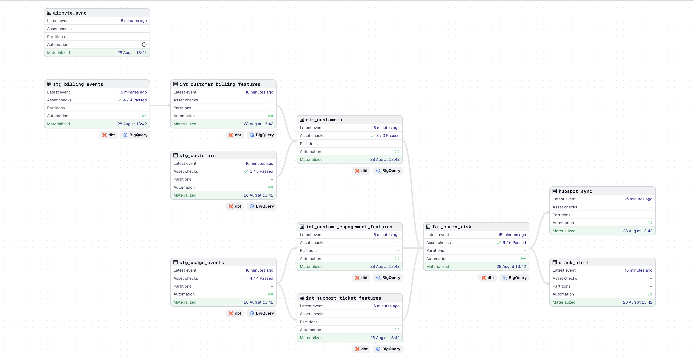
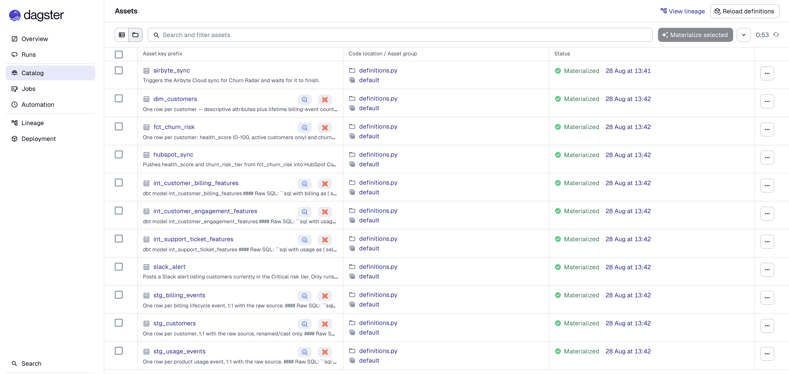
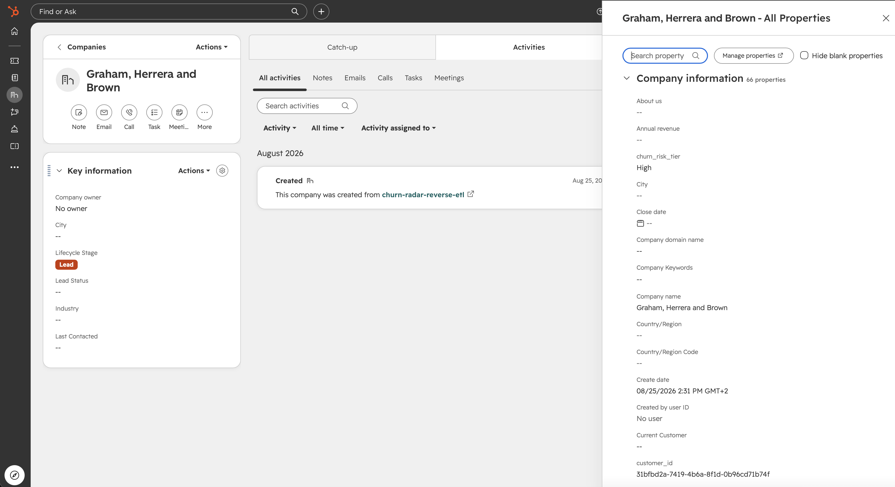
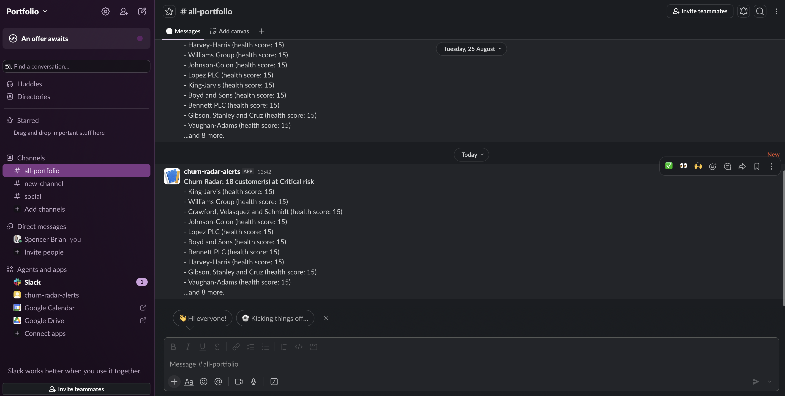

# Churn Radar

Customer health-scoring and churn-prevention platform for a simulated SaaS product.
Ingests product usage and billing events, models a composite health score and churn-risk
tier in dbt, orchestrates the pipeline with Dagster (asset graph, a sensor, asset checks),
and reverse-ETLs the results into HubSpot (Company records) and Slack (risk alerts).
Fully working end to end: a scheduled Airbyte sync lands raw data in BigQuery, a sensor
cascades into a dbt rebuild, a blocking data-quality check gates the churn-risk mart, and
only then does the pipeline push updated risk scores into HubSpot and post a Slack alert
for customers in the Critical tier.

Built to demonstrate two things the rest of this portfolio didn't yet cover: an
asset-aware orchestrator (as opposed to Airflow's task-based scheduling), and reverse
ETL moving data back out of the warehouse into the tools a team actually uses, not
just into dashboards.

**Warehouse: BigQuery** (same GCP project/account as
`data-engineering/b2b-realtime-spend-GCP`).

## Architecture

```
source_api/  (fake SaaS product, FastAPI + SQLite, deployed on Render)
    -> airbyte/  (config-as-code custom connector, Airbyte Cloud)
        -> BigQuery (raw landing: churn_radar_raw)
            -> dbt/  (staging -> intermediate -> marts: health score, churn risk)
                -> reverse_etl/  (HubSpot Company records + Slack alerts)

dagster/  orchestrates all of the above: a schedule triggers the Airbyte sync,
          an asset sensor fires as soon as that sync finishes and cascades into
          the dbt rebuild, and asset checks gate the churn-risk mart before
          reverse ETL runs.
```

Worth being precise about the sensor: it reacts to a Dagster event (the `airbyte_sync`
asset materializing), not to the source data actually changing -- it doesn't compare
row counts or check for new records before deciding to cascade. This is standard
event-driven orchestration ("when step A finishes, run step B"), not change-data-capture.
Real EL tools work the same way: they sync on a schedule and rely on incremental cursors
to only pull what's new, rather than checking upfront whether anything changed.

`source_api/` runs as a public Render web service so Airbyte Cloud can reach it
directly -- no local process or tunnel required for a sync to succeed.

## Build status

Building step by step, in this order:

1. **`source_api/`** -- fake SaaS product + synthetic data generator. *Done -- deployed on Render.*
2. **`dbt/`** -- staging/intermediate/marts modeling the health score and churn risk. *Done -- now runnable, raw data is landing in BigQuery.*
3. **`airbyte/`** -- config-as-code custom connector, source API -> BigQuery. *Done -- built and published in Airbyte Cloud, manifest saved in this repo.*
4. **`dagster/`** -- orchestration: dbt-as-assets lineage graph, schedule, asset sensor, asset checks. *Done -- full chain proven end to end (schedule -> Airbyte sync -> sensor -> dbt rebuild -> checks).*
5. **`reverse_etl/`** -- HubSpot Company records + Slack alerts, both gated by the blocking health-score check. *Done -- full chain proven end to end: sync -> dbt build -> checks -> HubSpot push -> Slack alert.*

The full pipeline is built and proven end to end. Reverse ETL logic currently lives
inside `dagster/definitions.py` alongside the orchestration code, rather than in a
separate `reverse_etl/` folder -- the two are small enough right now that splitting
them out didn't add clarity, though that's a reasonable future refactor as the project
grows.

## Why the synthetic data isn't random noise

Each generated customer is secretly assigned one of three behavior patterns --
healthy, at_risk, or churned -- that shapes how their login frequency, feature usage,
support tickets, and billing events are generated (e.g. at-risk customers show a real
drop-off in activity over their last 30-45 days, a higher support-ticket rate, and
often a failed payment before canceling). That internal label is never written to the
database or exposed through the API -- it exists only so the health-score model in
dbt has genuine behavioral signal to detect, instead of scoring pure randomness.

## Why Airbyte Cloud instead of a local install

The connector was originally built and tested locally via `abctl` (self-hosted Airbyte
on Kubernetes-in-Docker through OrbStack). That local install's "Publish to organization"
action hit a reproducible `errors.http.internalServerError`, confirmed across multiple
reinstalls. Rather than work around it with a stand-in script, the fix was to move to
the real, hosted Airbyte Cloud -- same connector, same manifest, genuinely working publish
path. The local install was torn down (`abctl local uninstall --persisted` +
`docker system prune -a`) once Cloud was confirmed working, reclaiming ~5 GB.

## Known limitation: sync mode is Full Refresh | Overwrite, not incremental

The custom connector currently issues a plain `GET` on every sync -- it doesn't inject a
`?since=<cursor>` parameter based on the last sync's high-water mark, even though
`source_api` already supports that cursor param for pagination. Because of that, every
stream runs as **Full Refresh | Overwrite**: each sync replaces the BigQuery table with
a fresh full pull, which is correct and duplicate-free, just not incremental. Adding a
declarative `IncrementalSync` component (cursor field + dynamic request parameter) to
`airbyte/churn_radar_source_manifest.yaml` is a legitimate future upgrade, not required
for correctness today.

## Known limitation: connector doesn't paginate

`source_api`'s endpoints cap out at 200-500 records per request (`/customers` defaults to
`limit=200`, the event endpoints to `limit=500`) and expect the caller to page through
with `?since=<cursor>` for the rest. The Airbyte connector's `HttpRequester` doesn't have
a pagination strategy configured, so it makes exactly one request per stream and stops --
meaning only the first 200 of the ~400 generated customers (and likely a similarly capped
slice of events) ever reach BigQuery. Confirmed by matching row counts in
`churn_radar_raw` and the downstream `fct_churn_risk` mart: both land at 200, so the drop
happens at ingestion, not in a dbt join. The correct fix is a `DefaultPaginator` in the
manifest that reads the last row's cursor field from each page and requests the next one
until a page comes back empty -- not built yet, noted here as a known gap rather than
silently shipped as if the full dataset were flowing.

## Pipeline in action

Screenshots below since most of this pipeline runs on private services (Airbyte Cloud,
Render, BigQuery, HubSpot) that nobody outside this account can browse -- unlike the
Olist project's dbt docs, there's no public link to click into here.

**1. Source API, live on Render**

`source_api` deployed as a public web service, serving the synthetic SaaS dataset over
HTTP so Airbyte Cloud can reach it directly -- no local process or tunnel involved.



**2. The Airbyte connector, tested against real data**

Both screenshots below are from Airbyte's Connector Builder: the `Customers` stream
pulling real records straight from the Render deployment, and the `Usage Events` stream
returning 500 real event records in response to a live test call.





**3. A real sync, end to end**

The Airbyte Cloud connection dashboard after a successful sync -- all three streams
synced, with load counts per stream (this is also where the pagination limitation above
is visible directly: Customers caps at 200 loaded, matching the known gap).



**4. Raw data landed in BigQuery**

Querying all three raw tables in `churn_radar_raw` directly in the BigQuery console --
confirms the data actually made it out of Airbyte and into the warehouse, not just that
Airbyte reported success.



**5. The full pipeline, orchestrated by Dagster**

The complete asset lineage graph: `airbyte_sync` feeding the dbt staging layer, through
the intermediate features, into `dim_customers` and `fct_churn_risk`, gated by passing
asset checks, and finally fanning out into `hubspot_sync` and `slack_alert`. Every node
green means the entire chain -- ingestion through reverse ETL -- ran successfully from
one sensor firing.



The same run from Dagster's asset catalog view, listing every asset with its description
and materialization status:



**6. Reverse ETL: HubSpot**

A real HubSpot Company record, upserted by `customer_id`, with `churn_risk_tier` written
directly onto it by the `hubspot_sync` asset -- pulled from BigQuery, not entered by hand.



**7. Reverse ETL: Slack**

The actual alert posted by `slack_alert` to a real Slack channel, listing customers
currently in the Critical risk tier with their health scores -- sent automatically as
part of the same run, no manual step involved.

