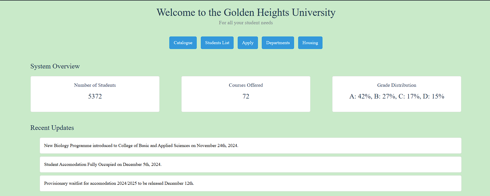

# GOLDEN HEIGHTS UNIVERSITY DATABASE
This is a database project for a fictional university Golden Heights located in Boston, Massachusetts. The entire database is fictitious and has not relation to any real world University or person(s). The estimated build time for this project from planning to final push/deployment for version 1 is 1 month and 3 weeks for a beginner data engineer/intermediate data analyst. This database will be have three versions with the version showing what has been added to the database or any new functionalities. Only a maximum of 4 years is covered in this project which will be adjusted after its success. ie. No student at the moment can be in fifth year because of a trail,fail or resit. This app predominantly uses `Flask` and `MongoDB`.

---

## Version 1
Version 1 will have the student collection, courses collection, department collection, housing collection, lecturer's collection as well as an advisors collection with over 25000 data points for students alone across multiple disciplines.

# Collections & Column Descriptions
These descriptions are genuinely to help me code faster and work faster after deciding what tools will be used as well as the level of detail required for every column and collection.

## Student Collection (75% Complete)
- First Name
- Last Name
- Gender (Uses the top 4 genders by numbers in the world: Male, Female, Transgender, Non-Binary)
- Age (Between 16 and 35 to allow for postgraduates and masters.)
- Department (64 departments grouped into 4 colleges)
- Email (Uniquely generated email for every student. Eg: bai.spen@golheights.com)
- College
- Country (Start dataset has only 123 countries listed.)
- Enrollment year(2020- 2024 only for this first version)
- Student id (uniquely generated student id based on department,enrollmentyear, and a random)
- Campus (The university has 4 campuses: Evergreen Heights, Summit Valley, Lakeside Vista & Golden Grove). I know, very fictitious.

## Courses Collection (90% Complete)
- Course Name / Title
- Course Code (Department-Year-Number)
- Department
- Credits
- Instructor / Lecturer
- Semester (Which semester is this course taught. Winter, Spring, Fall etc)
- Year (This refers to the intended year for the course, year 1, year 2 etc)

## Lecturer Collection (100% Complete)
- First Name
- Last Name
- Employee ID
- Lecturer ID
- Department
- Position (To introduce some politics later)
- Date of hire
- Courses taught 
- Salary details

## Advisors Collection (100% Complete)
- First Name
- Last Name
- Employee ID
- Students assigned (Use IDs only to keep confidential)

## Housing Collection (80% Complete )
- Hall / Dormitory Name
- Housing Type
- Capacity
- Move in year
- Move in semester
- Students (This will be a list of students per room/studio etc)
- Rent per student

# Version 2  (40% Complete)
Version 2 will include the grades and enrollment collections.

## Grades Collection
- Student id
- Course Code
- Grade
- Academic Year
- Semester

NB: The academic year and semester for a course should be associated to the course and the schedule of the school and not the grade. For electives only available electives can be registered for in that semester or year.

## Enrollment collection (0% Complete)
- Course ID
- Student ID
- Enrollment Date
- Enrollment status (Feature will be added that will allow to check a student's balance before moving from applied, procession to enrolled. For now, it's just a reminder and will say enrolled for all)

# Version 3
This version will include a financial aid and accounts collection to take profitability the project to the next level. Later to be linked to an international bank project that will allow direct account balance changes from bank payments. And yes, it's still just a project.

## Financial Aid collection (Weirdly this is already done)
- Financial aid name
- Amount
- Student (Also a list incase its a big scholarship for more than 1 student)

## Accounts 
- Student id
- Total Tuition Due
- Balance

The bank project is about 50% done and right after both projects are fully complete, the integration of the two will take place. 

# Version 4
This version will be a running school using realtime and real class schedules. For example students will be able to go to classes or miss them and take exams as well but it will be mostly automated. In this same version, an application feature will be made available to allow real human beings to apply to the school and go the semester. It will include actual classes with actual lessons as well as actual exams you have to ACTUALLY write and pass for the fun of it. Of course your tuition will be at the low low low LOW cost of 1$, I think. 

# Version 5
Futher develop this project into a game and an actual management system for high schools back in Africa.

# SCREENSHOTS
1. Home page 
2. Catalog page  
3. Student transcript 
4. Housing 
5. Departments 