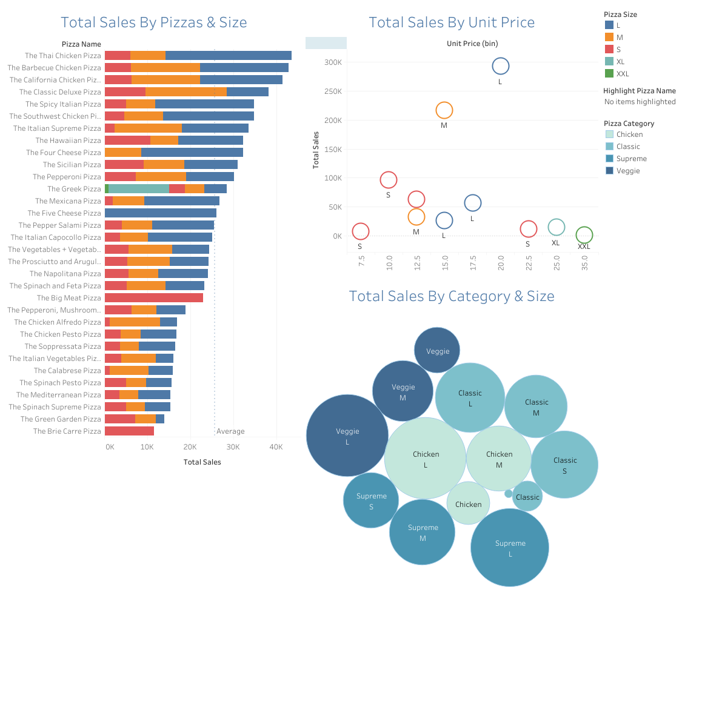
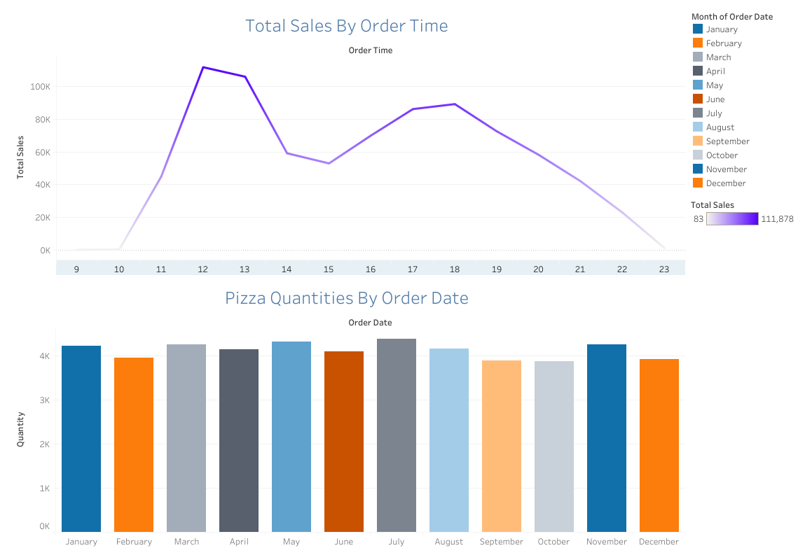

## Table of Contents
* [Datasets](#dataset)
* [Exploratory Data Analysis](#eda)
* [Questions](#questions)
* [Relational Database](#relational-database)
* [Data Visualization](#data-visualization)
* [Answered Questions](#answered-questions)

## Datasets
The project utilised just one dataset further split for normalization purposes.
The dataset was downloaded from Kaggle. The link to that dataset can be found [here](https://www.kaggle.com/datasets/shilongzhuang/pizza-sales). :point_left:

### NORMALIZED DATASETS
- Orders Table: A table for every order placed, the time it was placed, the kind of pizza and any other pizza or user purchase detail.
- Pizza :pizza: Table: A table for all pizzas created by the pizza place, its details and category.
- Categories Table: A table for all the various pizza categories.

## Exploratory Data Analysis
### Steps
- Import libraries and datasets.
- Check for missing or null values.
- Check datatypes for each attribute.
- Find the count of unique values per attribute.

## QUESTIONS
- What are the top 5 most purchased pizzas?
- What is the least purchased pizza?
- What is the most purchased pizza by category?
- What is the purchased category by size?
- What month has the most pizza sales?
- What month has the least pizza sales?
- What is the peak order time and the associated sales?

## Relational Database 
To reduce the effect of data redundancy, the entire dataset was split into 3 with orders as the facts table and the pizzas and categories table used for normalization purposes.
The relational database diagram for this project can be found below using [Quick DB](https://www.quickdatabasediagrams.com/)


### SQL QUERY
In order to get the final create the relational database, a sql query was created from Quick DB to set up the database in PostgresSQL.
```
SELECT o.order_details_id,
o.order_id,
o.pizza_id,
o.quantity,
o.order_date,
o.order_time,
o.category_id,
p.pizza_name,
p.unit_price,
p.pizza_size,
c.pizza_category
FROM orders o
LEFT JOIN pizza p 
ON o.pizza_id = p.pizza_num
LEFT JOIN categories c
ON o.category_id = c.cat_id
```

The database was modeled in PgAdmin using PostgreSQL with the aid of the table schema above.

## Data Visualization
Tableau public was used to create multiple visualizations to answer the questions asked prior to starting the project.
The dashboards and visualizations for the project can be found. [here](https://public.tableau.com/views/pizza_sales_16874426221130/TotalSales?:language=en-GB&:display_count=n&:origin=viz_share_link)




## Answered Questions
- What are the top 5 most purchased pizzas?
    1. The Thai Chicken Pizza
    2. The Barbecue Chicken Pizza
    3. The California Chicken Pizza
    4. The Classic Deluxe Pizza
    5. The Spicy Italian Pizza

- What is the least purchased pizza?
    1. The Brie Carrie Pizza

- What is the most purchased pizza by category?
    1. S(Small) - Classic
    2. M(Medium) - Supreme
    3. L(Large) - Veggie
    4. XL(Extra-Large) - Classic
    5. XXL(Extra-Extra-Large) - Classic

- What is the purchased category by size?
    1. S - The Big Meat Pizza
    2. M - The Classic Deluxe Pizza
    3. L - The Thai Chicken Pizza
    4. XL - The Greek Pizza
    5. XXL - The Greek Pizza

- What month has the most pizza sales?
    1. **July** with **$72,558** total sales from **4392** pizzas sold.

- What month has the least pizza sales?
    1. **October** with **$64,028** total sales from **3883** pizzas sold.

- What is the peak order time and the associated sales?
    1. 12:00:00 to 12:59:59 with $111,878 total sales.